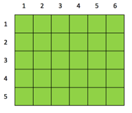
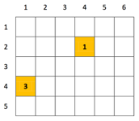
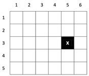
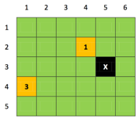
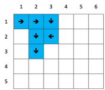

## About The Project

Showcase of Java development

### Context

The aim of the project is to simulate a treasure hunting.  
Adventurers are displayed on a grid map containaing treasures or mountains.

### The map

The map is a grid map where each tile is either a prairie or a mountain.  
By convention, lines are numbered from top to bottom in increasing order and columns are numbered from left to right in increasing order.  
In this mage below, each tile is a prairie:



In the map file, the above 6x5 map will be given as:

```txt
C 6 5
```

### Treasures

A tile may contain treasures, most of the tiles are empty but specific tiles contain one or more treasures.
See below image: there is one treasure on tile (4,2) and three treasures on tile (1,4).



In the map file, the treasures will be given as:

```txt
T 4-2 1
T 1-4 3
```

### Mountains

The map also contains mountains.
In the image below, a mountain is present on tile (5,3) representated by an 'x'.



In the map file, the mountains will be given as:

```txt
M 5-3
```

Put altogether, here's an example of map containing the above elements:



In the map file, the map will be given as:

```txt
C 6 5
T 4-2 1
T 1-4 3
M 5-3
```

### Adventurers

There may be multiple adventurers on the map.  
An adventurer can only move forward, turn to the right or left.  
Each action is representated by a letter: **A** to move forward, **D** to turn right and **G** to turn left.  
For example, the sequence `AADAGAGA` indicates the adventurer to:

1. move forward
1. move forward
1. turn right
1. move forward
1. turn left
1. move forward
1. turn left
1. move forward

Initially, an adventurer has an orientation: north, east, south or west.  
Given the above sequence, here is an example of an adventurer executing that sequence, facing initially east:



In the adventurers' file, the adventurers will be given as:

```txt
John 1-1 E AADAGAGA
```

### General notes

* The adventurers and their path will be given in a separate file, thus making easier mixing the map and the adventurers.
* When an adventurer steps on a tile containing treasures, they gain the treasures.
* It takes one second for an adventurer to execute an action **A**, **D** or **G**.
* An adventurer cannot walk on a mountain. In attempting to do so, nothing happens.
* An adventurer cannot walk on a tile occupied by another adventurer. In attempting to do so, the former waits until the tile is free.
* When an adventurer has executed every step of their path, they wait on site.

## Getting Started

### Prerequisites

1. Maven is required in order to build this project, refer to the [installation page](https://maven.apache.org/install.html).
1. Java 11.

### Installation

Run:

```
mvn install
```

### Usage

To build an executable, use:

```
mvn clean compile assembly:single
```

A jar is then produced in `target/`, by default the name is `treasure-map-1.0-SNAPSHOT.jar`.  
Then you can execute this jar with:

```
java -jar treasure-map-1.0-SNAPSHOT.jar
```

If no argument is provided then a demo version is played.  
In order to provide your own settings, add two arguments:

1. The first file is the adventurers' settings,
1. The second file is the map's settings.

```
java -jar treasure-map-1.0-SNAPSHOT.jar adventurers.txt treasure_map.txt
```

The files' name don't have to be exactly as above but the order must be respected.  
When the game has finished, the result is written to `result.txt`.

## License

Distributed under the MIT License. See [LICENSE](LICENSE)  for more information.
